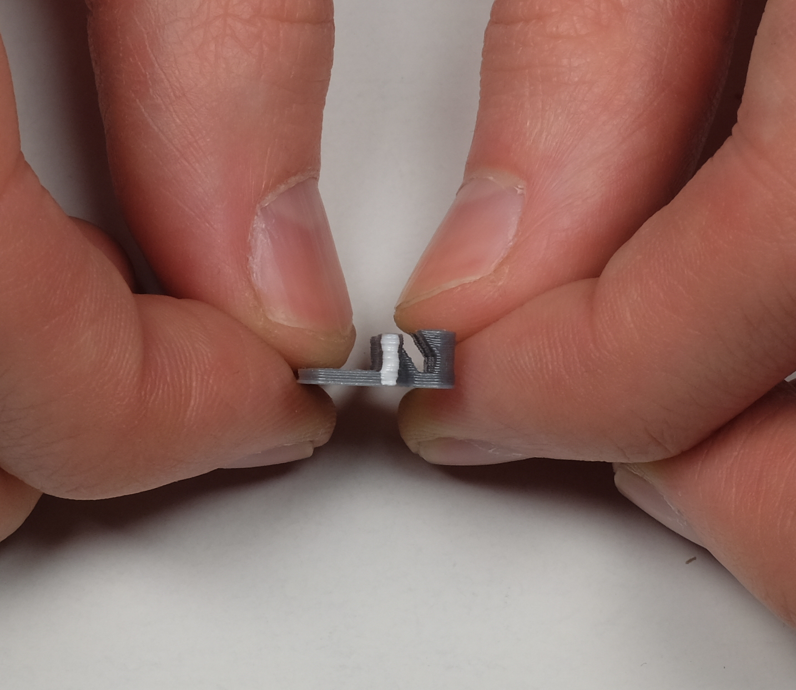
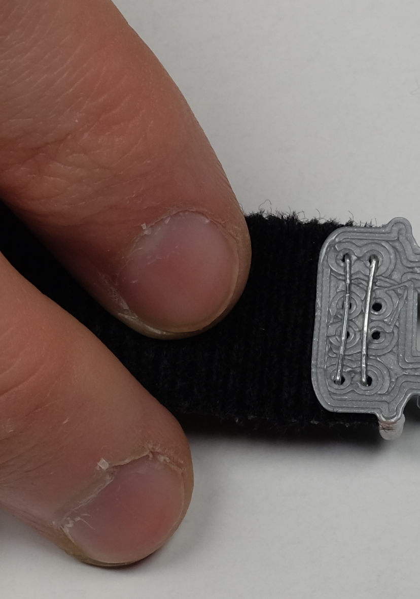

# What is the HaptiStrap?

How tightly a haptic device, such as a smartwatch, is strapped to the body can change how its vibrotactile effects are perceived.
Although a single researcher may be able to achieve reasonably consistent strap tightness across participants, this may not be easily achievable when multiple, potentially geographically distributed, experimenters are working with different participants.
Likewise, when participants must attach the devices on their own, e.g., during a longitudinal in-the-wild study, they may not use the same tightness each day.

The HaptiStrap is a low-cost, easily fabricated tool, loosely based on the medical Gulick tape measure, that helps to create consistent strap tension, and therefore haptic coupling, for wearable haptic devices used in user studies.
Since it is fabricated using 3d printing, the HaptiStrap can be easily modified to meet the requirements for a variety of body locations and experiment types.
Although HaptiStrap is not yet trialed with users, we present design iterations motivated by problems seen in our own work, as a contribution towards designing a standard method for ensuring that studies do better than vague ``tight but comfortable'' guidelines.

In this repository you will find all necessary files, fabrication, assembly and usage instructions to integrate the HaptiStrap in your project. In addition, since OpenSCAD design files are provided, a short step-by-step example is provided to adapt the HaptiStrap device to a different strap width. 

If you use the HaptiStrap, please do not forget to cite this publication:

INSERT PAPER BILIOGRAPHY ENTRY HERE.

# Table of Content
- [Making your Own HaptiStrap](#making-your-own-haptistrap)
  * [Equipment](#equipment)
  * [Choosing a Tensioner](#choosing-a-tensioner)
  * [3D Printing](#3d-printing)
    + [Get the Files](#get-the-files)
    + [Print the Files](#print-the-files)
  * [Putting it all Together](#putting-it-all-together)
    + [Elastic Tensioner](#elastic-tensioner)
    + [3D Printed Tensioner](#3d-printed-tensioner)
- [Using the HaptiStrap in your Project](#using-the-haptistrap-in-your-project)
  * [Determining how Many Elastics to use](#determining-how-many-elastics-to-use)
  * [Customizing HaptiStrap Dimensions to Match your Project](#customizing-haptistrap-dimensions-to-match-your-project)
  * [Adding the HaptiStrap to your Haptic System](#adding-the-haptistrap-to-your-haptic-system)
  * [Recommended Placement Instructions](#recommended-placement-instructions)
 
# Making your Own Haptistrap 

## Equipment
You will need the following equipment to make and assemble your own HaptiStrap:

1. FDM 3D printer
2. PLA filament (approximately 5 g or 2 m)
3. Orthodontic elastics (1/8", 1.8oz)
4. Pointy tweezers (useful for placing the elastics)
5. Highly visible permanent coating material (e.g., white/neon paint/nail polish, liquid paper, etc.)
6. Low-friction tape (e.g., teflon, aluminium, polyethylene tape etc.)

## Choosing a Tensioner

Despite making the 3D printed spring option available, we highly recommend using the elastic tensioner system for any application as it was shown to have more consistent mechanical properties.

## 3D Printing 

### Get the Files

Before printing your own HaptiStrap, you will need to download the STL files.

The type of tensioner you want to use dictates the path and file name of the files to download. As mentioned above, we highly recommend using the elastic tensioner.

| Tensioner Type | File|
|---|---|
|elastic|/stl/elastic/haptistrap_enclosure_elastic.stl|
||/stl/elastic/haptistrap_tensioner_elastic.stl|
||/stl/elastic/haptistrap_elastic_primer.stl|
|3D printed spring|/stl/3dPrintedSpring/haptistrap_enclosure_spring.stl|
||/stl/3dPrintedSpring/haptistrap_tensioner_spring.stl|
||/stl/3dPrintedSpring/haptistrap_spring_primer.stl|

### Print the Files

The HaptiStrap was designed such that it can be printed with the most commonly encountered 3D printer configuration, material (PLA) and slicing settings.

The following slicing parameters were used to obtain the components whose properties were measured and reported in the HaptiStrap paper. While you are free to modify any of them, these modifications could influence the mechanical properties of the produced component. 

| Parameter | Value | Unit |
|---|---|---|
|nozzle size|0.4|mm|
|layer height|0.2|mm|
|line width|0.4|mm|
|wall thickness|0.8|mm|
|top/bottom thickness|0.8|mm|
|infill density|100|%|

Notes:
- Supports should be used to ensure that the calibration windows on each side of the enclosure and lid are properly aligned.
- A brim, skirt or raft can be used to print the enclosure and its lid depending on your bed adhesion.
- For the 3D printed spring tensioner, it is preferable to print on a very smooth surface (e.g., glass, mirror, etc.) as the texture may increase friction between the spring and enclosure. As such, the use of a raft or brim is not recommended.

## Putting it all Together

Separate assembly instructions are provided depending on the type of tensioner used.

### Elastic Tensioner

|Instruction|Picture|
|---|-----|
|1. Place each elastic on the 3d printed elastic primer and wait for at least six (6) hours for their properties to settle.||
|2. Coat the pin on each side of the tensioner with highly visible material||
|3. Coat the indented half-circle on each side of the enclosure with highly visible material||
|4. Sew or staple a piece of velcro to the enclosure||
|5. Sew or staple a second piece of velcro to the tensioner||
|6. Using the pointy tweezers, carefully place the elastics such that forces are balanced between posts and that the elastics do not overlap. E.g.: EncPost1-TenPost1, EncPost4-TenPost2, EncPost2-TenPost1, EncPost3-TenPost2||
|7. Put the lid on||

To reduce friction and the likelihood of introducing vibration artifacts, we recommend applying a piece of low-friction tape (e.g., aluminium tape, polyethylene Film Tape, etc.) to the portion of the strap that is inside the enclosure at rest and the inside of the enclosure.

### 3D Printed Tensioner

|Instruction|Picture|
|---|---|
|1. Place the 3d printed spring on the primer and wait for at least six (6) hours for its properties to settle.||
|2. Coat the pin on each side of the tensioner with highly visible material||
|3. Coat the indented half-circle on each side of the enclosure with highly visible material||
|4. Sew or staple a piece of velcro to the enclosure||
|5. Sew or staple a second piece of velcro to the tensioner||
|6. Insert the tensioner in the enclosure by inserting the post in the opening in the center of the spring||
|7. Put the lid on||

# Using the HaptiStrap in your Project

## Determining how Many Elastics to Use 

The number of orthodontic elastics used in the HaptiStrap will directly modify the tension exerted by the tensioner on the overall system.

A calculator is provided to assist you in estimating the number of elastics needed for your specific application.

Calculator:
https://docs.google.com/spreadsheets/d/1YI04TUiVzIxZJ8hUbnIkhWvlUe_tBS4BZTtzd4iJfN4/edit?usp=sharing

## Customizing HaptiStrap Dimensions to Match your Project

The OpenSCAD design files available in the path /CAD/src/ allow you to customize the HaptiStrap to the specifications of your haptic project.

Here is an example, outlining the steps required to modify the enclosure dimension to accomodate for a 25 mm wide strap instead of the current 20 mm.

1. In file "haptistrap_enclosure.scad", change the value of strap_w, on line 46, from 20 to 25. By refreshing the preview, you will notice that this has widened the hole through which the strap enters the enclosure, and also the buckle through which the enclosure is attached to the strap.
2. In file "haptistrap_enclosure.scad", change the enclosure width by changing the value of o_w, on line 31, from 25 mm to 30 mm.
3. In file "haptistrap_tensioner.scad", change the tensioner's width by changing the value of o_w, on line 33, from 25 mm to 30 mm. This will reposition the elastic slots and bring the calibration pins closer to the outside walls. Note that it does not widen the base plate.
4. Render the model for each .scad file by using F6, or the button at the top of OpenSCAD's window.
5. Generate STL files for each .scad file by pressing the "stl" button at the top of OpenSCAD's window.

## Adding it to your Haptic System

The HaptiStrap must be inserted in series with your system's inelastic strap and haptic rendering component such that all of the tension goes through the tensioner.

Here is an example of how the HaptiStrap can be used with an original Pebble smartwatch:

## Recommended Placement Instructions

Here is a set of recommended placement instructions that allows to position both the HaptiStrap and haptic rendering system in a precise location when using a velcro strap:
1. Position and hold the Haptistrap in a comfortable position on the desired limb.
2. Position and hold the haptic rendering system where desired.
3. Pull on the velcro strap away from the limb, such that the visual indicators on both the tensioner and the enclosure are aligned.
4. Maintaining the tension, wrap the velcro strap around the limb such that it is secured to the rest of the system.
5. Validate that the visual indicators are still aligned, readjust as needed.
